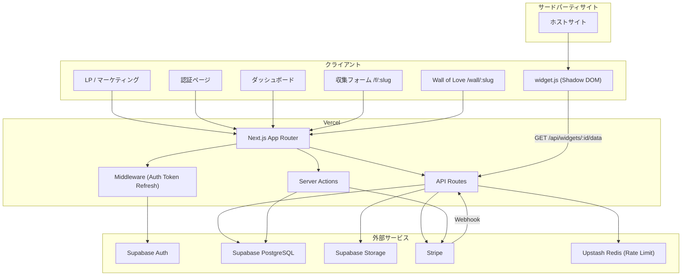
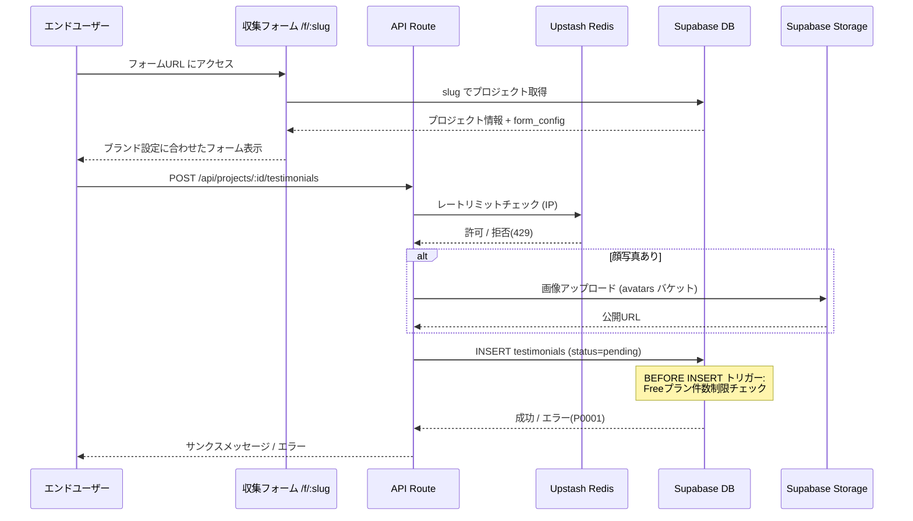
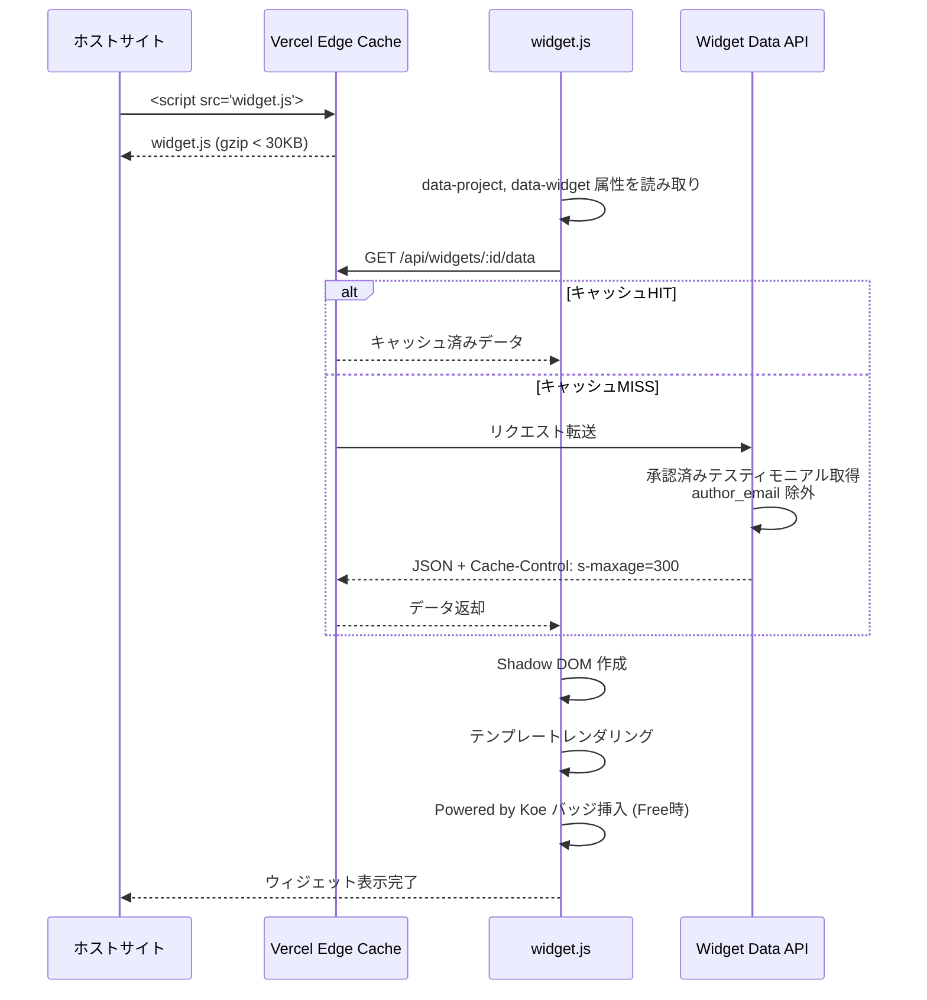
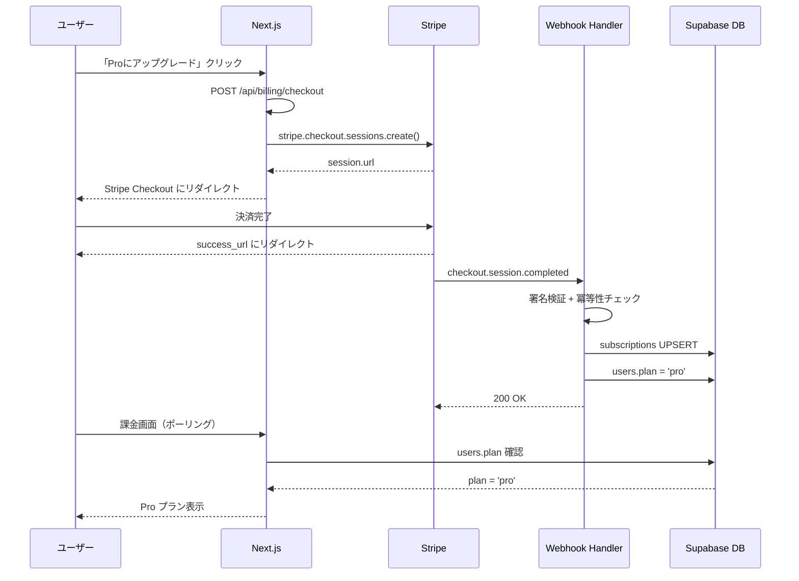
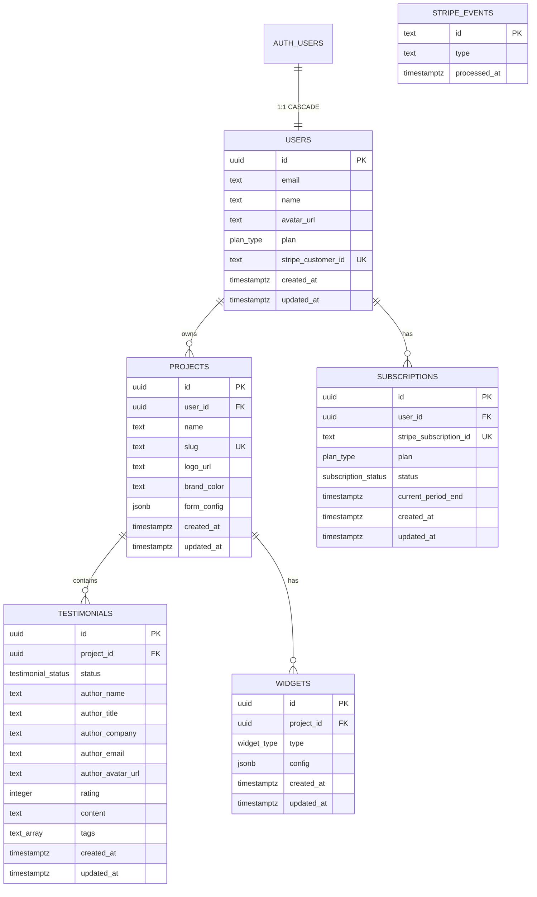
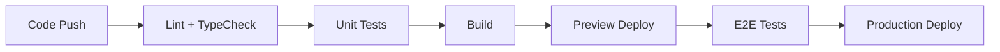

# 技術設計書

## 概要

Koeは Next.js App Router を基盤とし、Supabase（PostgreSQL + Auth）、Stripe、Vercel の構成で構築するテスティモニアルSaaSである。本設計書では、承認済み要件書（10要件・80受け入れ基準）を満たすための技術アーキテクチャ、コンポーネント設計、データフロー、API設計、セキュリティ・パフォーマンス戦略を定義する。

既存の詳細仕様書（`docs/specs/supabase-design.md`、`docs/specs/auth-flow.md`、`docs/specs/stripe-integration.md`）を設計の基盤として参照し、本ドキュメントではシステム全体のアーキテクチャとフロントエンド・バックエンド・ウィジェットの実装設計に注力する。

---

## 要件トレーサビリティ

### 設計コンポーネントと要件の対応

| 設計コンポーネント | 対応要件 |
|---|---|
| 認証レイヤー（Middleware + Supabase Auth） | 要件1: ユーザー認証（AC 1-9） |
| プロジェクトCRUD + プラン制限 | 要件2: プロジェクト管理（AC 1-9） |
| 公開フォームページ + API Route | 要件3: テスティモニアル収集フォーム（AC 1-10） |
| 管理画面 Dashboard | 要件4: テスティモニアル管理画面（AC 1-9） |
| widget.js + Shadow DOM + ウィジェットAPI | 要件5: 埋め込みウィジェット（AC 1-12） |
| Wall of Love 公開ページ | 要件6: Wall of Love ページ（AC 1-4） |
| Stripe Checkout / Webhook / Customer Portal | 要件7: 課金（AC 1-13） |
| LPページ（マーケティング） | 要件8: LPページ（AC 1-3） |
| RLS / レートリミット / Edge Cache | 要件9: セキュリティ・非機能要件（AC 1-8） |
| バッジコンポーネント（Widget内 + フォーム内） | 要件10: Powered by Koe バッジ（AC 1-4） |

---

## アーキテクチャ

### システム全体構成図



### 技術スタック

| レイヤー | 技術 | 選定理由 |
|---|---|---|
| フロントエンド | Next.js 15 (App Router) + React 19 | SSR/SSG、Route Groups、Server Components |
| スタイリング | Tailwind CSS v4 | ユーティリティファースト、高速開発 |
| UIコンポーネント | shadcn/ui | カスタマイズ性、Tailwind互換 |
| バックエンド | Next.js API Routes + Server Actions | Vercelとの統合、サーバーレス |
| データベース | PostgreSQL (Supabase) | RLS、リアルタイム、マネージド |
| 認証 | Supabase Auth + `@supabase/ssr` | Cookie ベース SSR 対応、OAuth |
| 決済 | Stripe (Checkout + Customer Portal) | 日本円対応、Webhook |
| レートリミット | Upstash Redis + `@upstash/ratelimit` | サーバーレス対応、低レイテンシ |
| ウィジェット | Vanilla JS + Shadow DOM | 軽量（30KB以下）、スタイル分離 |
| ファイルストレージ | Supabase Storage | アバター・ロゴ画像 |
| ホスティング | Vercel | Edge Network、自動スケール |
| フォームバリデーション | Zod + React Hook Form | 型安全、サーバー/クライアント共用 |

---

## プロジェクト構造

```
src/
├── app/
│   ├── layout.tsx                    # ルートレイアウト
│   ├── page.tsx                      # LP（マーケティング）
│   ├── (auth)/                       # Route Group: 認証系
│   │   ├── login/page.tsx
│   │   ├── register/page.tsx
│   │   ├── forgot-password/page.tsx
│   │   ├── reset-password/page.tsx
│   │   └── auth/callback/route.ts    # OAuth コールバック
│   ├── (dashboard)/                  # Route Group: 認証必須
│   │   ├── layout.tsx                # ダッシュボード共通レイアウト
│   │   ├── dashboard/page.tsx        # プロジェクト一覧
│   │   ├── projects/
│   │   │   ├── new/page.tsx          # プロジェクト作成
│   │   │   └── [projectId]/
│   │   │       ├── page.tsx          # テスティモニアル管理
│   │   │       ├── settings/page.tsx # プロジェクト設定
│   │   │       └── widgets/
│   │   │           ├── page.tsx      # ウィジェット一覧
│   │   │           └── [widgetId]/page.tsx # ウィジェット設定
│   │   └── billing/page.tsx          # 課金管理
│   ├── f/[slug]/page.tsx             # 公開: 収集フォーム
│   ├── wall/[slug]/page.tsx          # 公開: Wall of Love
│   └── api/
│       ├── projects/
│       │   ├── route.ts              # GET: 一覧, POST: 作成
│       │   └── [id]/
│       │       ├── route.ts          # GET, PATCH, DELETE
│       │       └── testimonials/
│       │           └── route.ts      # GET: 一覧, POST: 投稿(公開)
│       ├── testimonials/
│       │   └── [id]/route.ts         # PATCH, DELETE
│       ├── widgets/
│       │   ├── [id]/
│       │   │   ├── route.ts          # PATCH, DELETE
│       │   │   └── data/route.ts     # GET: ウィジェット表示用データ(公開)
│       │   └── route.ts              # POST: 作成
│       ├── billing/
│       │   ├── checkout/route.ts     # POST: Checkout セッション作成
│       │   └── portal/route.ts       # POST: Customer Portal
│       └── webhooks/
│           └── stripe/route.ts       # POST: Stripe Webhook
├── components/
│   ├── ui/                           # shadcn/ui コンポーネント
│   ├── layout/
│   │   ├── header.tsx
│   │   ├── sidebar.tsx
│   │   └── footer.tsx
│   ├── auth/
│   │   ├── login-form.tsx
│   │   ├── register-form.tsx
│   │   └── oauth-button.tsx
│   ├── dashboard/
│   │   ├── project-card.tsx
│   │   └── project-list.tsx
│   ├── testimonials/
│   │   ├── testimonial-card.tsx
│   │   ├── testimonial-list.tsx
│   │   ├── testimonial-filters.tsx
│   │   └── usage-indicator.tsx
│   ├── widgets/
│   │   ├── widget-preview.tsx
│   │   ├── widget-config-form.tsx
│   │   └── embed-code-copy.tsx
│   ├── forms/
│   │   ├── collection-form.tsx       # テスティモニアル収集フォーム
│   │   └── star-rating.tsx
│   ├── billing/
│   │   ├── plan-card.tsx
│   │   ├── upgrade-button.tsx
│   │   └── payment-status-banner.tsx
│   └── shared/
│       ├── powered-by-badge.tsx
│       └── copy-button.tsx
├── lib/
│   ├── supabase/
│   │   ├── client.ts                 # ブラウザ用クライアント
│   │   ├── server.ts                 # Server Component用クライアント
│   │   └── service-role.ts           # Service Role クライアント (Webhook用)
│   ├── stripe/
│   │   ├── client.ts                 # Stripe インスタンス
│   │   └── webhooks.ts               # Webhook ハンドラ群
│   ├── validators/
│   │   ├── testimonial.ts            # Zod スキーマ
│   │   ├── project.ts
│   │   └── widget.ts
│   ├── plan.ts                       # プラン判定ユーティリティ
│   └── utils.ts                      # 共通ユーティリティ
├── hooks/
│   ├── use-user.ts
│   └── use-plan.ts
├── types/
│   ├── database.ts                   # Supabase 生成型
│   └── index.ts
├── middleware.ts                      # Auth トークンリフレッシュ
└── widget/                            # 埋め込みウィジェット（別ビルド）
    ├── src/
    │   ├── index.ts                   # エントリポイント
    │   ├── render.ts                  # Shadow DOM レンダリング
    │   ├── api.ts                     # データ取得
    │   ├── styles.ts                  # インラインCSS
    │   ├── templates/
    │   │   ├── wall.ts                # Wall of Love テンプレート
    │   │   ├── carousel.ts            # カルーセルテンプレート
    │   │   └── list.ts                # リストテンプレート
    │   └── badge.ts                   # Powered by Koe バッジ
    ├── tsconfig.json
    └── rollup.config.js               # UMD ビルド設定
```

---

## データフロー

### 主要ユーザーフロー

#### フロー1: テスティモニアル収集（要件3）



#### フロー2: ウィジェット表示（要件5）



#### フロー3: Free → Pro アップグレード（要件7）



---

## コンポーネントとインターフェース

### バックエンドサービス

#### ProjectService

```typescript
class ProjectService {
  async list(userId: string): Promise<ProjectWithCount[]>        // ユーザーのプロジェクト一覧 + テスティモニアル件数
  async create(userId: string, data: CreateProjectInput): Promise<Project>  // プロジェクト作成（プラン制限チェック含む）
  async getById(projectId: string): Promise<Project>             // ID指定取得
  async getBySlug(slug: string): Promise<Project>                // スラッグ指定取得（フォーム用）
  async update(projectId: string, data: UpdateProjectInput): Promise<Project>  // 設定更新
  async delete(projectId: string): Promise<void>                 // カスケード削除
}
```

#### TestimonialService

```typescript
class TestimonialService {
  async list(projectId: string, filters?: TestimonialFilters): Promise<Testimonial[]>  // フィルタ付き一覧
  async submit(projectId: string, data: SubmitTestimonialInput): Promise<Testimonial>  // 公開投稿（レートリミット適用）
  async updateStatus(id: string, status: 'approved' | 'rejected'): Promise<void>      // 承認/非承認
  async updateTags(id: string, tags: string[]): Promise<void>    // タグ更新
  async updateDisplayName(id: string, name: string): Promise<void>  // 表示名編集
  async delete(id: string): Promise<void>                        // 削除
  async getUsage(projectId: string, plan: string): Promise<UsageInfo>  // 件数/上限情報
}
```

#### WidgetService

```typescript
class WidgetService {
  async create(projectId: string, data: CreateWidgetInput): Promise<Widget>  // ウィジェット作成
  async update(widgetId: string, data: UpdateWidgetInput): Promise<Widget>   // 設定更新
  async delete(widgetId: string): Promise<void>                  // 削除
  async getData(widgetId: string): Promise<WidgetData>           // 公開データ取得（author_email除外）
}
```

#### BillingService

```typescript
class BillingService {
  async createCheckoutSession(userId: string): Promise<{ url: string }>  // Checkout Session 作成
  async createPortalSession(userId: string): Promise<{ url: string }>    // Customer Portal
  async handleWebhook(event: Stripe.Event): Promise<void>        // Webhook ディスパッチ
  async getUserPlan(userId: string): Promise<'free' | 'pro'>     // プラン取得
}
```

### フロントエンドコンポーネント

| コンポーネント | 責務 | Props / State |
|---|---|---|
| `LoginForm` | メール+パスワードサインイン | state: email, password, error, loading |
| `RegisterForm` | メール+パスワードサインアップ | state: email, password, name, error, loading |
| `OAuthButton` | Google OAuth サインイン | props: provider |
| `ProjectCard` | プロジェクトカード表示 | props: project, testimonialCount |
| `ProjectList` | プロジェクト一覧 | props: projects |
| `TestimonialCard` | テスティモニアル個別カード | props: testimonial, onApprove, onReject, onDelete |
| `TestimonialList` | テスティモニアル一覧 | props: testimonials, filters |
| `TestimonialFilters` | フィルタUI（★、状態、タグ） | props: onFilterChange; state: activeFilters |
| `UsageIndicator` | 件数/上限表示（3/10件） | props: current, limit, plan |
| `WidgetPreview` | リアルタイムプレビュー | props: type, config, testimonials |
| `WidgetConfigForm` | デザイン設定フォーム | props: config, onChange; state: formValues |
| `EmbedCodeCopy` | 埋め込みコードコピー | props: projectId, widgetId |
| `CollectionForm` | テスティモニアル収集フォーム | props: project; state: formData, submitting |
| `StarRating` | ★評価入力 | props: value, onChange, readonly |
| `PlanCard` | プラン比較カード | props: plan, current, features |
| `UpgradeButton` | Proアップグレードボタン | props: disabled; state: loading |
| `PaymentStatusBanner` | 支払いステータスバナー | props: status ('past_due' 等) |
| `PoweredByBadge` | Powered by Koe バッジ | props: utmSource |
| `CopyButton` | クリップボードコピー | props: text, label |

### APIエンドポイント一覧

| メソッド | ルート | 用途 | 認証 | ステータスコード |
|---|---|---|---|---|
| POST | `/api/auth/signup` | サインアップ | 不要 | 201, 400, 500 |
| POST | `/api/auth/signin` | サインイン | 不要 | 200, 400, 401, 500 |
| POST | `/api/auth/signout` | サインアウト | 必須 | 200, 500 |
| GET | `/api/projects` | プロジェクト一覧 | 必須 | 200, 401, 500 |
| POST | `/api/projects` | プロジェクト作成 | 必須 | 201, 400, 401, 403, 500 |
| GET | `/api/projects/:id` | プロジェクト詳細 | 必須 | 200, 401, 404, 500 |
| PATCH | `/api/projects/:id` | プロジェクト更新 | 必須 | 200, 400, 401, 404, 500 |
| DELETE | `/api/projects/:id` | プロジェクト削除 | 必須 | 204, 401, 404, 500 |
| GET | `/api/projects/:id/testimonials` | テスティモニアル一覧 | 必須 | 200, 401, 404, 500 |
| POST | `/api/projects/:id/testimonials` | テスティモニアル投稿 | **不要** | 201, 400, 429, 500 |
| PATCH | `/api/testimonials/:id` | テスティモニアル更新 | 必須 | 200, 400, 401, 404, 500 |
| DELETE | `/api/testimonials/:id` | テスティモニアル削除 | 必須 | 204, 401, 404, 500 |
| POST | `/api/widgets` | ウィジェット作成 | 必須 | 201, 400, 401, 500 |
| PATCH | `/api/widgets/:id` | ウィジェット更新 | 必須 | 200, 400, 401, 404, 500 |
| DELETE | `/api/widgets/:id` | ウィジェット削除 | 必須 | 204, 401, 404, 500 |
| GET | `/api/widgets/:id/data` | ウィジェット表示データ | **不要** | 200, 404, 500 |
| POST | `/api/billing/checkout` | Checkout セッション | 必須 | 200, 400, 401, 500 |
| POST | `/api/billing/portal` | Customer Portal | 必須 | 200, 400, 401, 500 |
| POST | `/api/webhooks/stripe` | Stripe Webhook | Stripe署名 | 200, 400, 500 |

---

## データモデル

### エンティティ関連図



### TypeScript 型定義

```typescript
// types/database.ts

export type PlanType = 'free' | 'pro';
export type TestimonialStatus = 'pending' | 'approved' | 'rejected';
export type WidgetType = 'wall' | 'carousel' | 'list';
export type SubscriptionStatus = 'active' | 'canceled' | 'past_due';

export interface User {
  id: string;
  email: string;
  name: string;
  avatar_url: string | null;
  plan: PlanType;
  stripe_customer_id: string | null;
  created_at: string;
  updated_at: string;
}

export interface Project {
  id: string;
  user_id: string;
  name: string;
  slug: string;
  logo_url: string | null;
  brand_color: string;
  form_config: FormConfig;
  created_at: string;
  updated_at: string;
}

export interface FormConfig {
  fields: FormField[];
  thank_you_message: string;
}

export interface FormField {
  key: string;
  label: string;
  required: boolean;
}

export interface Testimonial {
  id: string;
  project_id: string;
  status: TestimonialStatus;
  author_name: string;
  author_title: string | null;
  author_company: string | null;
  author_email: string | null;
  author_avatar_url: string | null;
  rating: number;
  content: string;
  tags: string[];
  created_at: string;
  updated_at: string;
}

export interface Widget {
  id: string;
  project_id: string;
  type: WidgetType;
  config: WidgetConfig;
  created_at: string;
  updated_at: string;
}

export interface WidgetConfig {
  theme: 'light' | 'dark';
  show_rating: boolean;
  show_date: boolean;
  show_avatar: boolean;
  max_items: number;
  columns: number;
  border_radius: number;
  shadow: boolean;
  font_family: string;
}

export interface Subscription {
  id: string;
  user_id: string;
  stripe_subscription_id: string;
  plan: PlanType;
  status: SubscriptionStatus;
  current_period_end: string;
  created_at: string;
  updated_at: string;
}

// 集約型
export interface ProjectWithCount extends Project {
  testimonial_count: number;
}

export interface UsageInfo {
  current: number;
  limit: number;
  isAtLimit: boolean;
}

// ウィジェット公開データ（author_email除外）
export interface TestimonialPublic {
  id: string;
  author_name: string;
  author_title: string | null;
  author_company: string | null;
  author_avatar_url: string | null;
  rating: number;
  content: string;
  created_at: string;
}

export interface WidgetData {
  widget: { type: WidgetType; config: WidgetConfig };
  testimonials: TestimonialPublic[];
  plan: PlanType;  // バッジ表示判定用
}
```

### バリデーションスキーマ（Zod）

```typescript
// lib/validators/testimonial.ts
import { z } from 'zod';

export const submitTestimonialSchema = z.object({
  author_name: z.string().min(1, '名前は必須です'),
  author_title: z.string().optional(),
  author_company: z.string().optional(),
  author_email: z.string().email('有効なメールアドレスを入力してください').optional().or(z.literal('')),
  rating: z.number().int().min(1, '1以上で評価してください').max(5, '5以下で評価してください'),
  content: z.string().min(1, '感想は必須です'),
});

// lib/validators/project.ts
export const createProjectSchema = z.object({
  name: z.string().min(1, 'プロジェクト名は必須です').max(100),
  slug: z.string()
    .regex(/^[a-z0-9][a-z0-9-]{1,48}[a-z0-9]$/, 'スラッグは小文字英数字とハイフンのみ（3〜50文字）'),
  brand_color: z.string()
    .regex(/^#[0-9a-fA-F]{6}$/, '有効な16進数カラーコードを入力してください')
    .default('#6366f1'),
});
```

### データベーススキーマ

データベーススキーマの詳細（テーブル定義、インデックス、RLSポリシー、トリガー）は `docs/specs/supabase-design.md` に完全なSQL付きで定義済み。主要なポイント:

- **RLS**: 全テーブルで有効化。ユーザーは自分のデータのみアクセス可能
- **テスティモニアルINSERT**: anon（認証不要）で許可。`WITH CHECK (status = 'pending')` で承認済み投稿を防止
- **件数制限**: `BEFORE INSERT` トリガーでFreeプラン10件/プロジェクトを強制
- **インデックス**: `idx_testimonials_project_status` (project_id, status) が最頻出クエリに対応

### マイグレーション戦略

Supabase SQL Editor でSQLを直接実行する方式を採用（`docs/specs/supabase-design.md` 付録A参照）。将来的にはSupabase CLIの `supabase db diff` / `supabase migration` でバージョン管理に移行する。

---

## 認証設計

### Middleware（トークンリフレッシュ）

```typescript
// middleware.ts
import { createServerClient } from '@supabase/ssr';
import { NextResponse, type NextRequest } from 'next/server';

export async function middleware(request: NextRequest) {
  let supabaseResponse = NextResponse.next({ request });

  const supabase = createServerClient(
    process.env.NEXT_PUBLIC_SUPABASE_URL!,
    process.env.NEXT_PUBLIC_SUPABASE_ANON_KEY!,
    {
      cookies: {
        getAll() { return request.cookies.getAll(); },
        setAll(cookiesToSet) {
          cookiesToSet.forEach(({ name, value }) => request.cookies.set(name, value));
          supabaseResponse = NextResponse.next({ request });
          cookiesToSet.forEach(({ name, value, options }) =>
            supabaseResponse.cookies.set(name, value, options)
          );
        },
      },
    }
  );

  const { data: { user } } = await supabase.auth.getUser();

  // 認証必須ページへの未認証アクセスをリダイレクト（要件1 AC-8）
  if (!user && request.nextUrl.pathname.startsWith('/dashboard')) {
    const url = request.nextUrl.clone();
    url.pathname = '/login';
    return NextResponse.redirect(url);
  }

  return supabaseResponse;
}

export const config = {
  matcher: [
    '/((?!_next/static|_next/image|favicon.ico|widget.js|.*\\.(?:svg|png|jpg|jpeg|gif|webp)$).*)',
  ],
};
```

### Supabase クライアント初期化

3つのクライアントを `lib/supabase/` に配置:

| ファイル | 用途 | 使用箇所 |
|---|---|---|
| `client.ts` | `createBrowserClient` | Client Components |
| `server.ts` | `createServerClient` (Cookie経由) | Server Components, Route Handlers |
| `service-role.ts` | `createClient` (Service Role Key) | Webhook ハンドラのみ |

認証フローの詳細設計は `docs/specs/auth-flow.md` を参照。

---

## ウィジェット設計（widget.js）

### ビルド構成

- **ビルドツール**: Rollup（UMDフォーマット出力）
- **言語**: TypeScript（Vanilla JS、Reactなし）
- **出力**: `public/widget.js`（gzip後30KB以下）
- **Shadow DOM**: `mode: 'open'`（SEOインデックス対応）

### レンダリングフロー

```typescript
// widget/src/index.ts（概念）
(function() {
  const scripts = document.querySelectorAll('script[data-project][data-widget]');

  scripts.forEach(async (script) => {
    const projectId = script.getAttribute('data-project');
    const widgetId = script.getAttribute('data-widget');

    // 1. コンテナ作成
    const container = document.createElement('div');
    script.parentNode!.insertBefore(container, script);

    // 2. Shadow DOM 作成
    const shadow = container.attachShadow({ mode: 'open' });

    // 3. データ取得
    const data = await fetch(`${API_BASE}/api/widgets/${widgetId}/data`).then(r => r.json());

    // 4. スタイル注入
    const style = document.createElement('style');
    style.textContent = generateStyles(data.widget.config);
    shadow.appendChild(style);

    // 5. テンプレートレンダリング
    const html = renderTemplate(data.widget.type, data.testimonials, data.widget.config);
    const wrapper = document.createElement('div');
    wrapper.innerHTML = html;
    shadow.appendChild(wrapper);

    // 6. Powered by Koe バッジ（Freeプラン時）
    if (data.plan === 'free') {
      const badge = createPoweredByBadge();
      shadow.appendChild(badge);
    }
  });
})();
```

### Powered by Koe バッジ（要件10）

- Shadow DOM内にレンダリング → ホストサイトCSSで非表示にされることを防止
- クリック時: `https://koe.example.com/?utm_source=widget&utm_medium=badge&utm_campaign=plg` へ遷移
- Proプラン: APIレスポンスの `plan` フィールドで判定し、非表示

---

## エラーハンドリング

### エラーレスポンス形式

```typescript
interface ApiError {
  error: string;       // ユーザー向けメッセージ
  code?: string;       // 機械可読エラーコード
}
```

### エラーコード一覧

| コード | HTTP | 説明 | 対応要件 |
|---|---|---|---|
| `UNAUTHORIZED` | 401 | 未認証 | 要件1 AC-8 |
| `FORBIDDEN` | 403 | アクセス権限なし | 要件9 AC-1 |
| `NOT_FOUND` | 404 | リソース未発見 | 要件3 AC-9 |
| `VALIDATION_ERROR` | 400 | バリデーション失敗 | 要件3 AC-5,6 |
| `RATE_LIMITED` | 429 | レートリミット超過 | 要件3 AC-7 |
| `TESTIMONIAL_LIMIT_REACHED` | 400 | Free件数上限到達 | 要件3 AC-10 |
| `PROJECT_LIMIT_REACHED` | 403 | Freeプロジェクト数上限 | 要件2 AC-6 |
| `ALREADY_SUBSCRIBED` | 400 | 既にProプラン | 要件7 AC-9 |
| `WEBHOOK_SIGNATURE_INVALID` | 400 | Webhook署名検証失敗 | 要件7 AC-10 |
| `INTERNAL_ERROR` | 500 | サーバーエラー | - |

### クライアントサイドエラーハンドリング

- バリデーションエラー: Zod + React Hook Form でインラインエラー表示
- APIエラー: トースト通知（shadcn/ui Sonner）
- テスティモニアル上限到達: アップグレード促進ダイアログ
- 支払い失敗: ダッシュボード上部にバナー表示（要件7 AC-13）

---

## セキュリティ

### 認証・認可マトリクス

| リソース | 未認証 | 認証済み（オーナー） | 認証済み（他者） | Service Role |
|---|---|---|---|---|
| テスティモニアル投稿 | INSERT (pending のみ) | INSERT (pending のみ) | INSERT (pending のみ) | 全操作 |
| テスティモニアル参照 | approved のみ | 全件 | approved のみ | 全件 |
| テスティモニアル更新/削除 | 不可 | 可 | 不可 | 可 |
| プロジェクト操作 | 不可 | CRUD | 不可 | 全操作 |
| ウィジェット設定参照 | 可（UUID推測不可） | 可 | 可 | 全操作 |
| ウィジェット更新/削除 | 不可 | 可 | 不可 | 可 |
| サブスクリプション参照 | 不可 | 自分のみ | 不可 | 全操作 |
| サブスクリプション変更 | 不可 | 不可 | 不可 | Webhook経由のみ |

### データ保護

- **author_email**: ウィジェットAPI・公開ページでは除外。管理画面のみ表示（要件4 AC-9, 要件5 AC-12, 要件9 AC-4）
- **service_role キー**: `NEXT_PUBLIC_` プレフィックスなし。Webhook ハンドラ内でのみ使用（要件9 AC-2）
- **Stripe Webhook**: 署名検証必須 + `stripe_events` テーブルで冪等性管理（要件7 AC-10,11, 要件9 AC-6）
- **入力バリデーション**: Zod スキーマでサーバーサイド検証。DB側もCHECK制約で二重防御

### レートリミット

- **テスティモニアル投稿**: 10件/時間/IP（Upstash Redis sliding window）（要件3 AC-7, 要件9 AC-7）
- **Billing API**: 10回/分/ユーザー

### CORS

- ウィジェットAPI (`/api/widgets/:id/data`): 全オリジン許可（公開API）
- その他API: Same-origin のみ

---

## パフォーマンスとスケーラビリティ

### パフォーマンス目標

| メトリクス | 目標値 | 計測対象 | 対応要件 |
|---|---|---|---|
| ウィジェットデータ取得 | < 200ms | `/api/widgets/:id/data` | 要件5 AC-5 |
| フォーム表示 | < 1秒 | `/f/:slug` 初回ロード | 要件3 AC-1 |
| widget.js サイズ | < 30KB (gzip) | CDN 配信 | 要件5 AC-11 |
| API応答（p95） | < 300ms | 認証済みAPI全般 | - |
| DB クエリ（p99） | < 50ms | Supabase クエリ | - |

### キャッシュ戦略

| レイヤー | 対象 | TTL | 実装 |
|---|---|---|---|
| CDN (Vercel Edge) | ウィジェットデータ | 5分 (s-maxage=300) + SWR 60秒 | Cache-Control ヘッダー |
| CDN | widget.js | 1日 (immutable + content hash) | Vercel 自動 |
| CDN | 収集フォームページ | ISR 60秒 | Next.js revalidate |
| ブラウザ | 静的アセット | 1年 (immutable) | Next.js 自動 |

### スケーラビリティ

- **アプリケーション**: Vercel Serverless Functions による自動スケール
- **データベース**: Supabase PostgreSQL + Connection Pooling (pgbouncer, Transaction mode)
- **ウィジェット配信**: Vercel Edge Network でグローバル配信
- **レートリミット**: Upstash Redis（グローバルレプリケーション対応）

---

## テスト戦略

### テストカバレッジ目標

| テスト種別 | カバレッジ | 対象 |
|---|---|---|
| ユニットテスト | ≧ 80% | バリデーション、ユーティリティ、サービスロジック |
| 統合テスト | 全APIエンドポイント | API Routes、Webhook ハンドラ |
| E2Eテスト | 主要ユーザーフロー | 認証、テスティモニアル投稿・承認、ウィジェット表示 |

### テストツール

| ツール | 用途 |
|---|---|
| Vitest | ユニットテスト・統合テスト |
| Testing Library | Reactコンポーネントテスト |
| Playwright | E2Eテスト |
| Stripe CLI | Webhook ローカルテスト |
| MSW (Mock Service Worker) | API モック |

### E2Eテストシナリオ

| # | シナリオ | 対応要件 |
|---|---|---|
| 1 | サインアップ → プロジェクト作成 → フォームURL取得 | 要件1, 2 |
| 2 | フォームからテスティモニアル投稿 → 管理画面で承認 | 要件3, 4 |
| 3 | ウィジェット設定 → 埋め込みコード取得 → 表示確認 | 要件5 |
| 4 | Free → Pro アップグレード（Stripe テストカード） | 要件7 |
| 5 | Pro → Free ダウングレード（Customer Portal） | 要件7 |
| 6 | Freeプラン件数上限到達 → 投稿拒否確認 | 要件3 AC-10 |
| 7 | レートリミット超過 → 429エラー確認 | 要件3 AC-7 |
| 8 | Webhook 重複イベント → 冪等性確認 | 要件7 AC-11 |

### CI/CD パイプライン



- **Lint**: ESLint + Prettier
- **TypeCheck**: `tsc --noEmit`
- **Preview Deploy**: Vercel Preview（PRごと）
- **Production Deploy**: `main` ブランチマージ時に自動デプロイ
